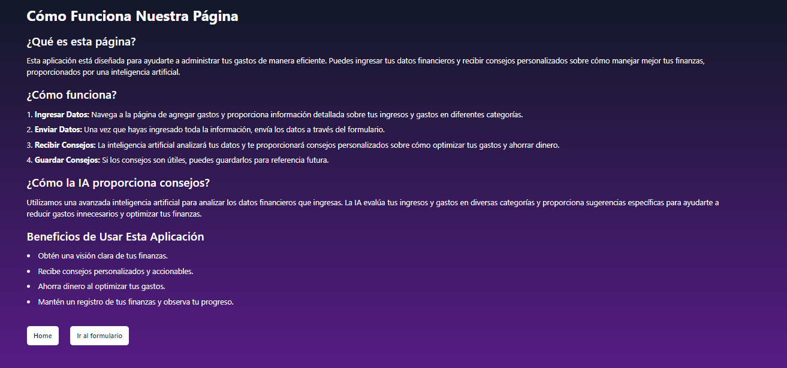
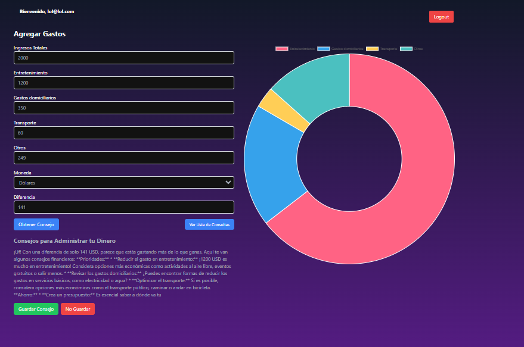
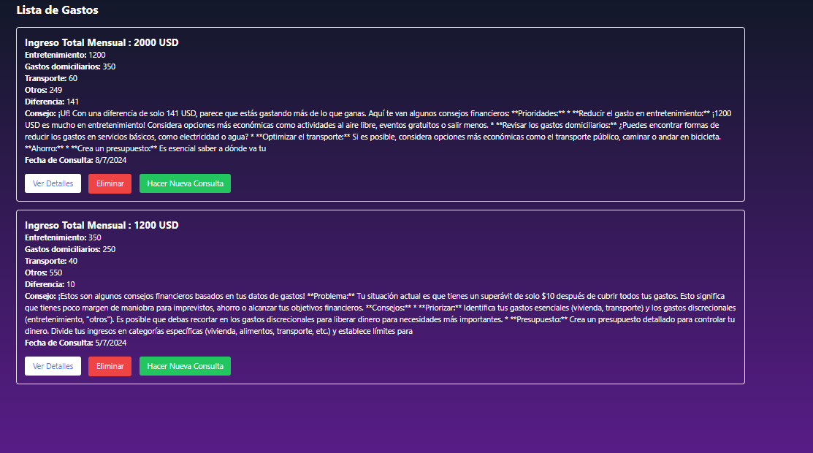
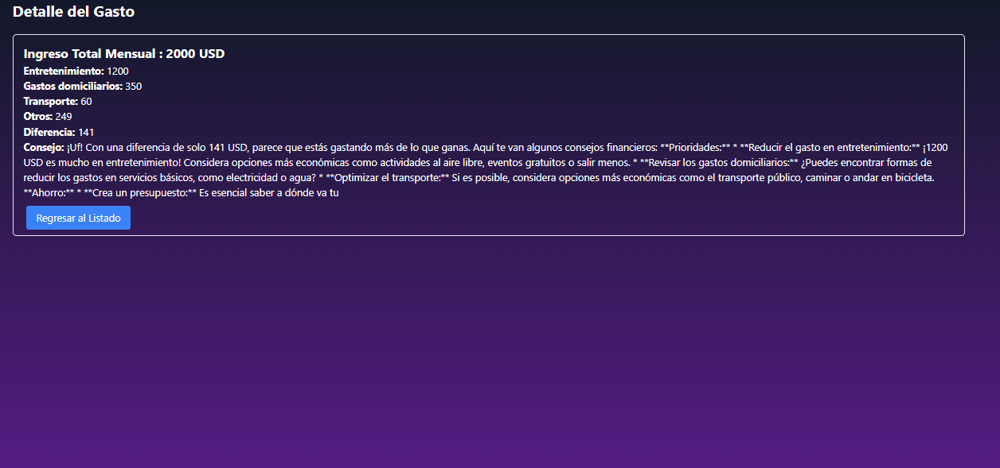

# Gestor de Finanzas Personales

## Description

- Gestor de Finanzas Personales es una aplicación que ayuda a los usuarios a gestionar sus finanzas personales, hacer un seguimiento de sus gastos e ingresos, y obtener recomendaciones personalizadas para ahorrar dinero. La aplicación también proporciona gráficos y análisis para ayudar a los usuarios a entender mejor sus hábitos financieros.


## Características

- Registro de usuario
- Inicio de sesión de usuario
- Protección de rutas con autenticación
- Consejos financieros basicos

## Tecnologías Utilizadas

- React
- Firebase (Autenticación, Firestore-Database)
- React Router
- React context
- Gemini AI API, para los consejos financieros
- daisyUI + Tailwind CSS para el diseño de la pagina

## Instalación

Para instalar y ejecutar esta aplicación localmente, sigue los siguientes pasos:

1. Clona el repositorio:
   ```bash
   git clone https://github.com/LucasFeli/S9-Gestor-Personal.git
   ```
2. Navega al directorio del proyecto:

   - cd Consultor-de-gastos-personales

3. Instala las dependencias:
    ```sh
     npm install
    ```

## Ejecución
Para ejecutar la aplicación en modo de desarrollo, usa el siguiente comando:
```sh
npm run dev
```

- La aplicación estará disponible en http://localhost:5173.


##  Configuracion de Firebase

1. Ve a Firebase Console y crea un nuevo proyecto.
2. Agrega una nueva aplicación web al proyecto y copia la configuración de Firebase.
3. Crea un archivo firebaseConfig.js en el directorio src/firebase y pega tu configuración de Firebase:

```js
import { initializeApp } from "firebase/app";
import { getAuth } from "firebase/auth";
import { getFirestore } from "firebase/firestore";

const firebaseConfig = {
  apiKey: "TU_API_KEY",
  authDomain: "TU_AUTH_DOMAIN",
  projectId: "TU_PROJECT_ID",
  storageBucket: "TU_STORAGE_BUCKET",
  messagingSenderId: "TU_MESSAGING_SENDER_ID",
  appId: "TU_APP_ID"
};

const app = initializeApp(firebaseConfig);
export const auth = getAuth(app);
export const db = getFirestore(app);
export default app;
```

<br>

## Estructura del Proyecto

├── assets/<br>
├── components/<br>
│ ├── ExpenseDetail/<br>
│ │ └── ExpenseDetail.jsx<br>
│ ├── ExpenseList/<br>
│ │ └── ExpenseList.jsx<br>
│ ├── formularioGastos/<br>
│ │ └──FormularioGastos.jsx<br>
│ ├── graficoGastos/<br>
│ │ └──GraficoGastos.jsx<br>
│ ├── login/<br>
│ │ └──Login.jsx<br>
│ ├── modal/<br>
│ │ └──Modal.jsx<br>
│ ├── privateRoute/<br>
│ │ └──PrivateRoute.jsx<br>
│ ├── register/<br>
│ │ └──Register.jsx<br>
│ └── Logout.jsx<br>
├── context/<br>
│ ├── AuthContext.jsx<br>
│ └── DatabaseContext.jsx<br>
├── pages/<br>
│    └──HomePage.jsx<br>
├── services/<br>
│ ├── firebase.jsx<br>
│ └── GeminiService.jsx<br>
├── App.css<br>
├── App.jsx<br>
├── index.css<br>
└── main.jsx<br>

## Descripción de las Rutas

/: Ruta principal que carga el componente HomePage.<br>
/login: Ruta para el componente de inicio de sesión Login.<br>
/register: Ruta para el componente de registro Register.<br>
/expenses: Ruta protegida que carga el componente ExpenseList dentro de PrivateRoute.<br>
/add-expense: Ruta protegida que carga el componente FormularioGastos dentro de PrivateRoute.<br>
/expense/
: Ruta protegida que carga el componente ExpenseDetail dentro de PrivateRoute, donde :id es el identificador del gasto.<br>
/logout: Ruta protegida que carga el componente Logout dentro de PrivateRoute.<br>

| Path                      | Componente            | Permisos                 | Comportamiento                                                     |
| ------------------------- | -------------------- | --------------------------- | ------------------------------------------------------------ |
| `/`                       | Pagina de inicio            | público `<Route>`            | Página de inicio
| `/how-it-works`           | Pagina de explicacion de la pagina            | público `<Route>`            | Pagina de explicacion de la pagina                                                     |
| `/register`                 | Pagina de Registro           | público `<Route>`    | Formulario de Registro, link to login,  |
| `/login`                  | Pagina inciar sesion           | público `<Route>`     | Login form, link to register,  |
| `/expenses`               | Lista de gastos    | solo usuario `<PrivateRoute>`  | Página ingresar informacion sobre ingresos y gastos
| `/add-expense`           | Formulario para agregar gastos      | solo usuario  `<PrivateRoute>`  |Formulario ingresar informacion sobre ingresos y gastos y redirige a la lista de gastos , una vez que se ha agregado los gastos y el consejo |
| `/expense/:id`           | Pagina de detalle de gastos y consejos   | solo usuario `<PrivateRoute>`  | Página con los detalles de gastos y consejos, contiene un boton, para regresar al listado de gastos|


## Capturas de la pagina

- Pagina de explicacion de la pagina



- Pagina del formulario de la pagina



- Pagina de lista de los gastos



- Pagina de detalle del gasto 

